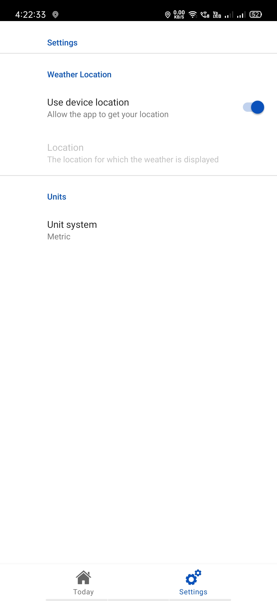

# Weather App

This is a simple weather app which uses an [Weather-Api](https://www.weatherapi.com/)  to fetch data and displays it in the app.

Major Libraries used are:

1. Gson
2. Kotlin coroutines
3. Room Library
4. Glide

### Home Screen
Home screen contains different kinds of Layouts and Views.

Horizontal RecyclerView

CardView

### Settings Screen
It is a PreferenceScreen 

### Loading 

###### Whole application in action 
https://user-images.githubusercontent.com/74159416/103134200-9bc09500-46d5-11eb-925c-faeb130bedf1.mp4
